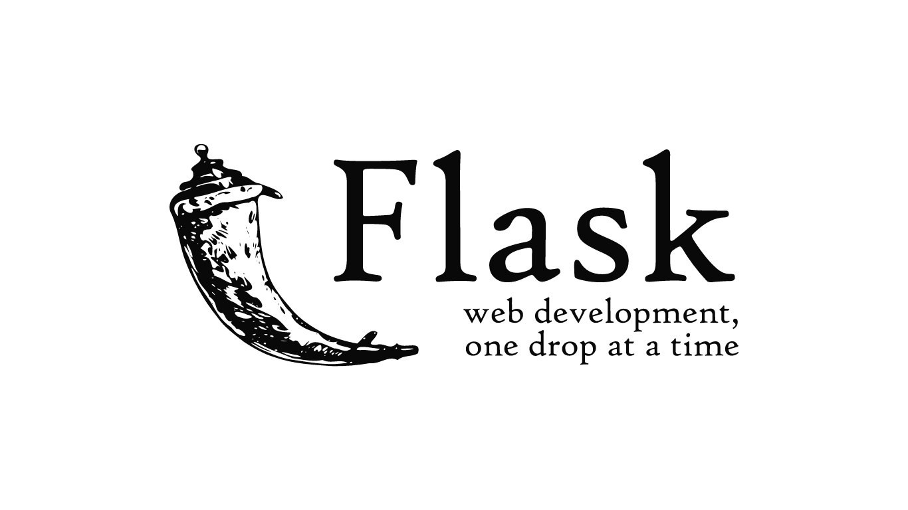

# PROJECT - CRUD

This is a CRUD Aplication develop with Flask, HTML & CSS.
It registers users and stores their data as well as their profile photos.

---

* **Requirements for use this APP:**
  * Python 3.9.6 or higher
  * Create Virtual Machine
  * Use MySQL manager.

---

* **Install Packages:**
  * pip install Flask
  * pip install PyMySQL

* **Or execute this command:**
  * pip install -r requirements.txt

---

* **For running, run the command:**
  * ```python app.py``` (Windows)
  * ```python3 app.py``` (Mac OS, Linux)

---

#### _Development By__ JorgeGarcia_Dev